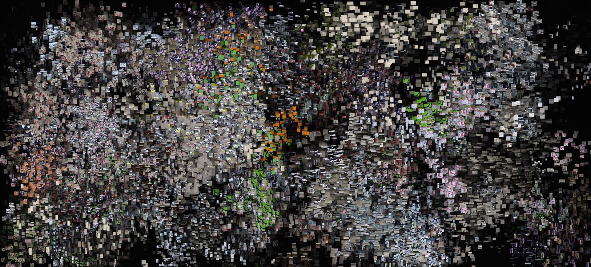
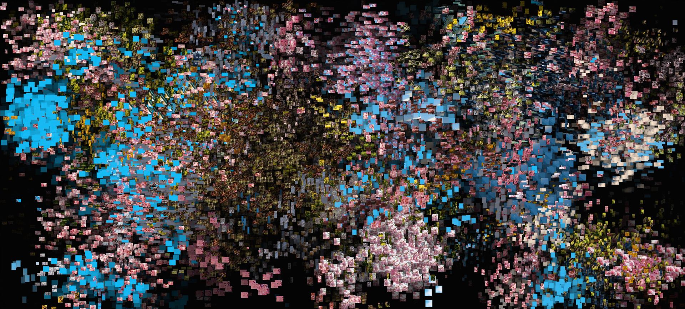
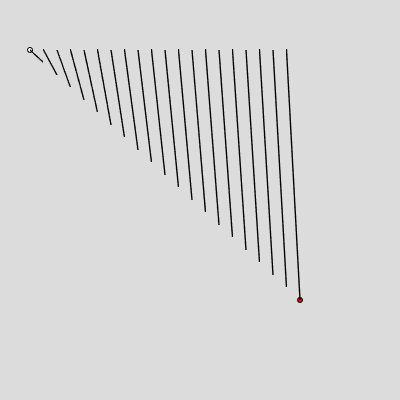
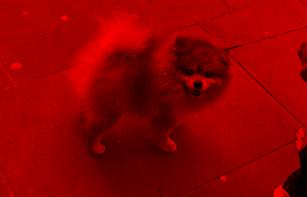
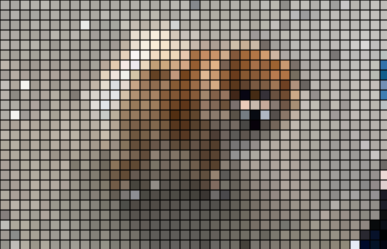
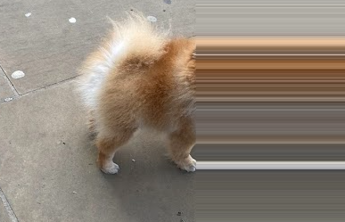
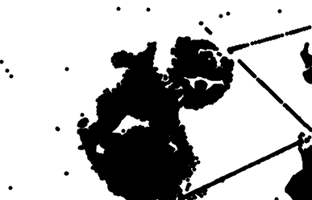
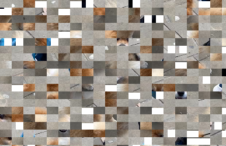

## Is Photography Over? 

**Reflection on "Is Photography Over?" by Trevor Paglen**

If algorithms and databases act as the “scripts” behind ANPR and other seeing machines, then themes and creative ideas act as the scripts behind the everyday and aesthetic photography we produce with our phones and cameras. In both cases, images are guided by an underlying structure or intention, rather than being neutral. 

When I first saw Michael Najjar’s High Altitude series, I didn’t think it had much context beyond showing dramatic mountain landscapes. After learning about the post-processing involved, especially how financial graphs are integrated into the images, the work became much more meaningful. Knowing that these images were made around 2008–2010 also adds context, as this was a time of global financial crisis. Najjar isn’t trying to show an accurate representation of the landscape in the way traditional photography might aim to. Instead, he shows how he wants to see the world.

Using Paglen’s idea of “seeing machines,” these systems don’t just look at the world but try to understand it and act on it, often through scanning systems and databases. Najjar’s process in High Altitude feels similar to how people edit selfies to look “better” before posting them online — both involve shaping images with a specific goal or outcome in mind. In this way, photography becomes less about recording reality and more about directing how something should be seen.

The idea of the “annihilation of space by time” can also be applied here, as financial graphs that represent decades of market data are compressed and embedded into a single image. Time, data, and space are all collapsed into one photograph, turning it into something closer to a system of information than a simple picture.  

I didn’t really get why post-mortem pictures are classified as “bending time” by the author. A picture of someone dead before burial is still a picture taken at a specific point in time, and to me it doesn’t immediately feel like time is being bent. However, when I look at photographs from the past of someone who used to be alive — even a family member I never met who died a long time ago — that feels more like bending time, because my brain fills in imagined moments from the past and tries to reconstruct how they once lived.
Post-mortem photographs perhaps give us a sense of life and death existing at the same time. The body belongs to the moment after death, and pictures are something we normally associate with life. However, I still don't undrstand why this is bending time. 

**CODING**
## Selfish Pixel (Code Art Work)  


view link: https://editor.p5js.org/sizalyth/full/f8qNYMILh 
code link: https://editor.p5js.org/sizalyth/sketches/f8qNYMILh   

Images are everywhere on the internet, and one of their most common uses is as memes. Internet memes are constantly shared, changed, and redistributed. The word meme comes from one of my faourite thinkers, Richard Dawkins', in his book The Selfish Gene. He made it sound similar to gene, and he postulated that cultural information spreads by imitation, replicating and proliferating in much the same way that genes do. 

Each pixel is a gene, a meme, and random 30 pixels are plotted onto the canvas first. Then, their 'offspring' copies it to neibouring area with slight shift of source pixel area, but these offsprngs fade quickly or they have 60% chance of added to the main population array to live longer. There's a cap of 2000 on the population, and one element fades. There's also 30% chance of new elements being born in draw().   

Original Picture : Picture of Barghain entrance 


I tried different pictures too with different colour profile:  
Japan

fog  


For this fog image, I also created another version where I extract just the pixel colour information and then outputs it the same way.  


```js
let img;
let seeds = [];
let newseeds = [];

function preload() {
  img = loadImage("Barghain.jpg");
}

function setup() {
  background(100);
  createCanvas(windowWidth, windowHeight);
  img.loadPixels();
  angleMode(DEGREES);
  let n = 30;
  firstPixels(n); //first call to create the first pixels.
}

function firstPixels(n) {
  for (let i = 0; i < n; i++) {
    let w = random(5, 20); //size of the pixel units.
    let h = random(5, 20); 

    seeds.push({
      x: random(width), //where the pixel will be plotted onto
      y: random(height),
      sx: floor(random(img.width - w)), //the source xy cooridinates from image.
      sy: floor(random(img.height - h)),
      w: w, 
      h: h,
    });
  }
}

function draw() {
  background(0, 30); // fade

  for (let p of seeds) {
    image(img, p.x, p.y, p.w, p.h, p.sx, p.sy, p.w, p.h);
  }
  spread();//jumps to this function, and puts values into the newseeds array
  
  for (let q of newseeds) {
    image(img, q.x, q.y, q.w, q.h, q.sx, q.sy, q.w, q.h);
  }

  if (random() < 0.3) { //30% chance of newborns/new memes 
    firstPixels(30);
  }

  for (let q of newseeds) {
    if (random() < 0.6) { //60% chance of living longer, because newseeds will be cleared every frame
      seeds.push(q);
    }
  }
  newseeds = []; //cleared
  while (seeds.length > 2000) {
    seeds.splice(floor(random(seeds.length)), 1); //removes 1 index from population of pixels when 2000 of them so that it doesn't increase too much. 
  }
}

function spread() {
  
  for (let p of seeds) {
    if (random() < 0.7) { //70% chance of happening
      let angle = random(-360, 360); //by having - and +, doesn't just go into one direction. 
      let d = random(5, 60);

      let nx = p.x + cos(angle) * d; //new pixels will be plotted around the area of original
      let ny = p.y + sin(angle) * d;

      if (nx < 0 || nx > width || ny < 0 || ny > height) continue;

     
      let ms = random(-5, 5); //very slight shift in where it samples the original pixel, so it's not exact same replication

      newseeds.push({ //store the new child pixels (plotted in draw)
        x: nx,
        y: ny,
        sx: constrain(p.sx + ms, 0, img.width - p.w),
        sy: constrain(p.sy + ms, 0, img.height - p.h),
        w: p.w,
        h: p.h,
      });
    }
  }
}


```

**REVIEW**

Dashed Line  

Some happy accidents:   

```js
 let xd = dx / numStep;
  let yd = dy / numStep;
  let x0 = p1.x;
  let y0 = p1.y;
  for (let i = 0; i <= numStep; i++) {
    let progress = i / numStep;
    let x = lerp(p1.x, p2.x, progress);
    let y = lerp(p1.y, p2.y, progress);
    line(x0, y0, x, y);
    x0 = x; //just updating x 
  }
```

I created the dashed lines by having arbitary += when updating the new starting x and y values. 
```js
function setup() {
  createCanvas(400, 400);
  background(220);
  let p1 = { x: 30, y: 50 };
  circle(p1.x, p1.y, 5);
  let p2 = { x: 300, y: 300 };
  fill("red");
  circle(p2.x, p2.y, 5);
  let dashlength = 40;
  let x0 = p1.x;
  let y0 = p1.y;
  let dx = p2.x - p1.x;
  let dy = p2.y - p1.y;
  let ang = atan2(dy, dx);
  let numSteps = 10;
 let steps = 20;
  for (i = 0; i < steps; i++){
    let progress = i/steps;
    let x = lerp(p1.x, p2.x, progress);
    let y = lerp(p1.y, p2.y, progress);
  
    line(x0, y0, x, y);
    x0 = x+10;
    y0 = y+10;
  }
}
```
Recursion - when function calls itself.  
array.forEach() - calls function on every element   
array.filter() - for elements that retunr true   
array.sort(), array.map() etc.   

Understanding recursion   
Questions I had in the class code was 'what is length*3 for? (because buffer), why is able to draw many dashes with just one line() but that's because the a and b point values keep updating and splitting in mid point means 2, 4, 8 branches are created.  
```js I tried to recreate and memorise the code.  

function setup() {
  createCanvas(400, 400);
  background(220);
  let p1 = { x: 30, y: 50 };
  circle(p1.x, p1.y, 5);
  let p2 = { x: 300, y: 300 };
  fill("red");
  circle(p2.x, p2.y, 5);
  let dashedLength = 5;
  dashedLine(p1, p2, 5);
 }

function dashedLine(a, b, Length){
  let d = dist(a.x, a.y, b.x, b.y);
  
  if(d>Length*2){
    let mid = {};
    mid.x = lerp(a.x, b.x, 0.5);
    mid.y = lerp(a.y, b.y, 0.5);
    dashedLine(a, mid, Length);
    dashedLine(mid, b, Length); 
  }
  else{
    let ang = atan2(b.y - a.y, b.x - a.x);
    let X1 = a.x + cos(ang)*Length;
    let Y1 = a.y + sin(ang)*Length;
    let X2 = b.x -cos(ang)*Length;
    let Y2 = b.y -sin(ang)*Length;
    line(X1, Y1, X2, Y2);
    
  }
 ```
Transforming Media:  
Averaging, slit-scanning, collage, glitch   
scaling - image(myimage, 100, 100, 400, 400) 
index = (width*y) + x*4   
pixel[] - whatever is on the canvas/screen   
img.pixeles[] - specific image.  
To make a picture grayscale, we have to make RGB values excatly the same.   
Brightness(r,g,b) , perceived brightnness and values of each rgb channel.  
```js 

function draw() {
  background(220);
  
  loadPixels();
  for (y = 0; y<height; y++){
    for(x = 0; x<width; x++){
      let index = (x + y*width) *4
      pixels[index+0] = random(255);
      pixels[index+1] = random(255);
      pixels[index+2] = random(255);
      pixels[index+3]= random(255);
    }
  }
  updatePixels()
}
```
Exercise 1: Red Scale    
  
The initial mistake I made was not using brightness as variable but overwriting by 255 on the channel I want.   
```js
let img;
function preload() {
  img = loadImage("dog.png");
}
function setup() {
  createCanvas(img.width, img.height);

  img.loadPixels();

  for (let y = 0; y < img.height; y++) {
    for (let x = 0; x < img.width; x++) {
      let index = (x + y * img.width) * 4;
      let r = img.pixels[index + 0];
      let g = img.pixels[index + 1];
      let b = img.pixels[index + 2];
      let br = (r + g + b) / 3;
      img.pixels[index + 0] = br;
      img.pixels[index + 1] = 0;
      img.pixels[index + 2] = 0;
      img.pixels[index + 3] = 255;
    }
  }
  img.updatePixels();
  image(img, 0, 0);
}
```

Exercise II: Inversion (255-original value for each channel    


```js 

let img;
function preload() {
  img = loadImage("dog.png");
}
function setup() {
  createCanvas(img.width, img.height);

  img.loadPixels();

  for (let y = 0; y < img.height; y++) {
    for (let x = 0; x < img.width; x++) {
      let index = (x + y * img.width) * 4;
      let r = img.pixels[index + 0];
      let g = img.pixels[index + 1];
      let b = img.pixels[index + 2];

      img.pixels[index + 0] = 255 - r;
      img.pixels[index + 1] = 255 - g;
      img.pixels[index + 2] = 255 - b;
      img.pixels[index + 3] = 255;
    }
  }
  img.updatePixels();
  image(img, 0, 0);
}
```
Point-sampling (fill() with x and y values skipping pixels).   


```js
let img;
function preload() {
  img = loadImage("dog.png");
}
function setup() {
  createCanvas(img.width, img.height);

  img.loadPixels();

  for (let y = 0; y < img.height; y+=10) {
    for (let x = 0; x < img.width; x+=10) {
      let index = (x + y * img.width) * 4;
      let r = img.pixels[index + 0];
      let g = img.pixels[index + 1];
      let b = img.pixels[index + 2];

      img.pixels[index + 0] = 255 - r;
      img.pixels[index + 1] = 255 - g;
      img.pixels[index + 2] = 255 - b;
      img.pixels[index + 3] = 255;
      fill(r, g, b);
      square(x, y, 50);
    }
  }
  img.updatePixels();
}
```
Exercise III : Picking a column in an image and stretching (slit=-scan effect)  

```js
let img;
function preload() {
  img = loadImage("dog.png");
}
function setup() {
  createCanvas(img.width, img.height);
  img.loadPixels();

  let column = 220;

  for (let y = 0; y < height; y++) {
    for (let x = column; x < width; x++) {
      let index = (x + y * img.width) * 4;
      let sourceIndex = (column + y * img.width) * 4;
      let r = img.pixels[sourceIndex];
      let g = img.pixels[sourceIndex + 1];
      let b = img.pixels[sourceIndex + 2];

      img.pixels[index] = r;
      img.pixels[index + 1] = g;
      img.pixels[index + 2] = b;
      img.pixels[index + 3] = 255;
    }
  }

  img.updatePixels();
  image(img, 0, 0);
}
```
Exercise IV: Image of horizontal and vertical lines   
 let col = img.get(x, y); returns each pixel values rgba.   
 brightness is average of rbg/3.  
 max() meeans pick maximum value between a, b.    
 
```js
let img;
function preload() {
  img = loadImage("dog.png");
}
function setup() {
  createCanvas(img.width, img.height);
  img.loadPixels();
}
function draw() {
  background(255);

  fill(0);
  noStroke();
  let thresh = 100;
  thresh = map(mouseX, 0, width, 0, 200);
  for (let y = 0; y < height; y++) {
    for (let x = 0; x < width; x++) {
      let col = img.get(x, y);

      let br = (col[0] + col[1] + col[2]) / 3; //we can determine how prominent this pixel is
      if (br < thresh) {
        let sz = 255 - br;
        ellipse(x, y, 5, 5);
      }
    }
  }
}
```

Exercise V: randomised grid    
.copy - copies pixel information   
copy(
  srcImage,  // where pixels come from
  sx, sy,    // top-left of source rectangle
  sw, sh,    // width & height of source rectangle
  dx, dy,    // where to paste
  dw, dh     // size when pasted (can stretch)
);   

```js
let img;
let blocks = [];
let sizeX;
let sizeY;

function preload() {
  img = loadImage("dog.png");
}
function setup() {
  createCanvas(img.width, img.height);

  sizeX = ceil(img.width / 20);
  sizeY = ceil(img.height / 20);
  console.log(sizeX);
  console.log(sizeY);

  for (let y = 0; y < img.height; y += sizeY) {
    for (let x = 0; x < img.width; x += sizeX) {
      let block = createImage(sizeX, sizeY);
      block.copy(img, x, y, sizeX, sizeY, 0, 0, sizeX, sizeY);
      blocks.push(block);
    }
  }
  blocks = shuffle(blocks);
}

function draw() {
  let idx = 0;
  for (let y = 0; y < height; y += sizeY) {
    for (let x = 0; x < width; x += sizeX) {
      image(blocks[idx], x, y);
      idx++;
    }
  }
}
```


