## Random Walk and Brownian Motion 

1. map() function
```js
var col = 0;
    
function setup() {
  createCanvas(400, 400);
}

function draw() {
  col = map(mouseX, 0, 600, 255, 0);
  background(col);
  ellipse(mouseX, 200, 64, 64);
}
```
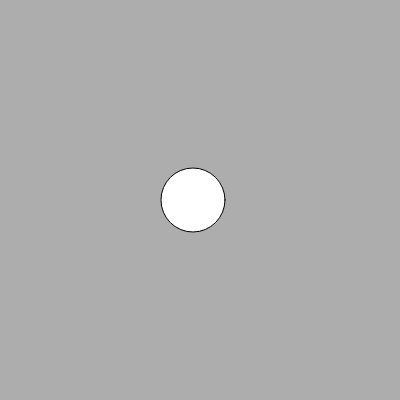

 2. Nested loops (applying to colour gradient)
   ```js
    let col;
 let r = 40;

function setup() {
  createCanvas(650, 360);
  frameRate(5);
}

function draw() {
  background(255);
  noStroke();

  for (let y = 0; y <= height; y += 50) {
    for (let x = 0; x <= width; x += 50) {
      col = map(x, 0, width, 0, 255);
      col1 = map(y, 0, height, 0, 255);
      fill(col + col1 - 250, col + col1 - 250, col + col1);
      ellipse(x, y, r);
    }
    r = random(35, 45);
  }
}
```
   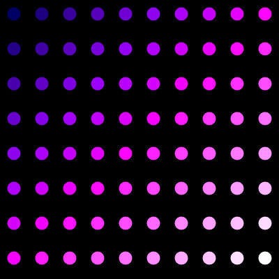

   3. Arrays[]
```js
let words = ['hello', 'my name is', 'delyth'];
let index = 0;

function setup() {
  createCanvas(400, 400);
}

function draw() {
  background(0);
  
  fill(255);
  textSize(32);
  text(words[index], 12, 200);
}

function mousePressed(){
  index += 1; 
  if (index === 3){
    index = 0;
  }
}
```
  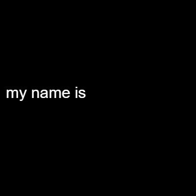

   4. random()  
      p5 random fucntion cannot be used outside of set up, as a global variable.
      Also, I learnt that putting the random() in draw() would refresh too many times, so by putting it i setup() it would only run once. 
```js
let roofTopX = 200;
let roofTopY = 100;
let roofR;
let roofL;
let r1, g1, b1;
let r2, g2, b2;
let houseLeftTop; 
let houseLeftBottom;
let houseRightTop; 
let houseRightBottom;


function setup() {
  createCanvas(400, 400);
  r1 = random(255); //by setting the colour random here instead if in draw, it doesnt get flashy. 
  r2 = random(255);
  g1 = random(255);
  g2 = random(255);
  b1 = random(255);
  b2 = random(255);
  
  roofR = random(250, 380); 
  roofL = 400 - roofR; //to make it symmetrical at the axis of x = 200
  
  houseLeftTop = random(50, 150);
  houseRightTop = (400 - houseLeftTop) - houseLeftTop;

}

function draw() {

  background(110, 0, 255, 127);
  fill(0, 255, 0, 150);
  rect(0, 280, 400);
  
  fill(r1, g1, b1);
  triangle(roofTopX, roofTopY, roofL, 170, roofR, 170);
  fill(r2, g2, b2);
  rect(houseLeftTop, 170, houseRightTop, 170)
}
```
<video src="b7f6867b-6279-4c04-a8ae-7dc9325ae0a6.mp4" autoplay loop muted playsinline style="max-width: 100%;">
</video>

5. random walk()  
   Brownian motion, animal forging for food, stock price fluctuations. Stochastic succession of steps. random() is uniform distrubution of probability, whereas random walk is based on the previous outcome.  
   floor() - round it down to 3 even if its 3.9  
   ceil() - round it up to 4 even if it's 3.1  
   round() - 3.4 becomes 3, 3.5 becomes 4.  
   Levy flight - varying the probability of the stepsize.  
   My initial attempt was not doing a random walk(), which the code was this:  
```js
let x;
let y;
let x1;
let y1;

function setup() {
  createCanvas(400, 400);
  frameRate(5);
}

function draw() {
   background(100);
  x=200;
  y=200;
  for (i = 0; i<100; i++){
  stroke(255);
  x1 = x+random(-4, 4);
  y1 = y+random(-4, 4);
  line(x, y, x1, y1)
  x = x1;
  y = y1;
  }
}


```
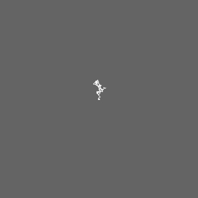
My preview looked like it was starting from centre again and lines already made, instead of forming one by one.   
To fix this, I must put the initialising variables x and y = 200 out of draw(). Also, background (100) to setup too.   
 
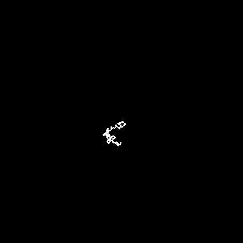

**READING**
The reading on Langdon Winner's Moses Bridge revealed to me how intention of a single person with enormous power can easily influence a structure and create inequality and propagate racism. 
I simultneously thought, this could not easily happen in the times we live now. For someone who is not elected (Moses) to have such a centralised power and control over multiple areas in public affair is unusual now, and protests would spark to stop the development if people are made aware, probably during this time, information was not as transparent between public officials and citizens, and also prejudice was accepted with no right to protest for black minorities. It was interesting to look at nuclear power plants as centralised power and solar panels as democratic too, I never thought of it that way. We can install solar panels on our houses and have control over, but we have significantly less control over power we get from privately owned or government owened energy sources. Maybe there are less problems related to work conditions but increase in gas prices and scarcity due to foreign affairs immediately affect us. However, I see nuclear power plants as a risky (safer to be controlled securely) but very stable way to power the nation with growing population and we absolutely need them. Some structures are centralised and that is the only way it can operate. What we can reduce that is a negative effect of centralisation is exactly like the case of McCormick, where a single man can have power over human welfare. By having workers unions and legislations that are monitored well, this can be reduced. Making the work place democratic within a centralised industry like transport or power stations is important.     
This reminded me of a case in Japan, with the use of the term 障害（shogai) - a word meaning disabled. The kanji used here 害 (gai) means toxic or damage, which is very negative to describe someone with handicapped. It's pprobably similar to people opposed to the use of the word 'disabled' too. There have been movements to not use the kanji 害 but just write it out as hiragana, which will then not symbolise damage the way the kanji does. Like this 障がい。It's such a small thing but you can appreciate when someone use this instead, it shows awareness and compassion. Words and kanji are not inherently harmful, but the context it is used by us shapes the way we think about them.   

Vera Molnar's interview video: Her response to whether she sees computer as a slave to carry out her ideas or as a tool that she can also find inspiration from was interesting. The element of 'surprise' which we get from computer generation that we don't get from handwriting is very true. "An intuition of an artist is the 'random walk' on the computer". 

**CODING**  
Before attempting to replicate Vera Molnar's work, I took away these key points from her MIT press reading:  
- "What are the specific elements of a composition that cause it to give to me aesthetic satisfaction?"
- "Whenever I begin a picture, I have an initial idea of it in mind".
- "I develop a picture by means of a series of small probing steps and each step is followed by evaluation".
- "I modify in a stepwise manner" (when creating first draft, and by compring the successive versions she can decide whether the trend is towards the direction she desires).
- Rather than beginning with initial set of rules (how the parameters can be varied or limited), she tries to elaborate on these set of rules as the work progresses. (Only one parameter varied in succession, and when the picture approaches ideal, smaller changes are introduced.
- Available variables : (a) number of sets (b) concentric squares within set (c) displacement (d) deformation (e) line elimination (f) replacement of straight lines with curves etc..

I picked this image.  
Within a rectangle, there are three columns. Each column contains a stack of 14 rectangles that are long horizontally, and the space between them are not uniform. There is an unifrom space between each columns and margins too. White background. 
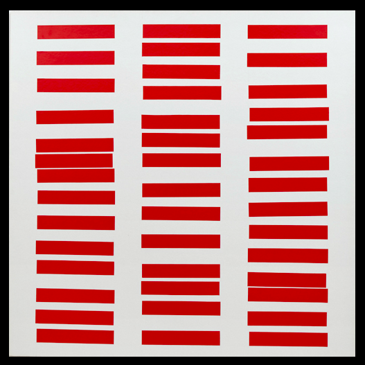

My final code https://editor.p5js.org/sizalyth/sketches/wtsCCwHSa 

I started by setting up the three columns of the rectangles and assessing by eye approximmately where they would fit in the square.  
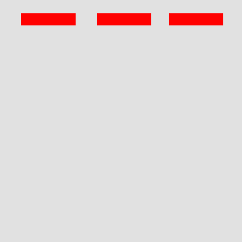  
Then, I used for loops to multiple the rectangles. Initially, the second rectangle was overlappting with the first and looked thicker, my maths was incrementing y = 35 + i*25. 
I thought I can do the randomness of the spacing afterwards, and this was how it looked at this stage.   
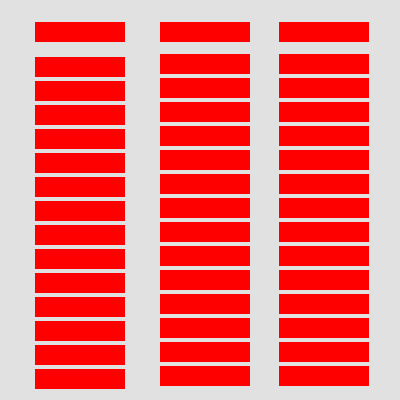  
With using randomness as a multiplier for y axis value wasn't really working, and I realised also it's not really random for each column as it follows an equation.    
Like random walk, I have to randomise the distance taking the value of the previous value, also I have to create an if statement so that the margin at the bottom is still there. 
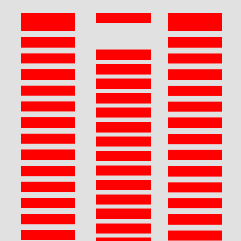  
This kind of multiplication makes the data skewed towards the first index.   
```js
   let y = 35;
  //repetition for the left column
  for (i = 0; i < 14; i++) {
    rect(35, y, 90, 17);
    y = y + (i*random(5));
     
  }
```
I figured out that just randomising the value to add to the successive y would be the best for now.     
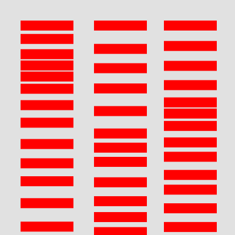
random(18, 40) gave the closest results to the work after trying different values. 
```js
  let y = 35;
   let y2 = 35;
  let y3 = 35;
  //repetition for the left column
  for (i = 0; i < 14; i++) {
    rect(35, y, 90, 17);
    y = y + random(18,40);
  }
  
  //repetition for the middle column
  for (j = 0; j < 14; j++) {
    rect(160, y2, 90, 17);
    y2 = y2 + random(18,40);
  }
  //repetition for the right column
  for (k = 0; k < 14; k++) {
    rect(279, y3, 90, 17);
    y3 = y3 + random(18, 40);
  }
}
```
Now, I have to work out how to create margin at the bottom without losing the number of rectangles. Reducing the maximum value of random() was not helping either.  
The bottom three triangles across the column seem to be same position, so maybe Molnar wanted the top and bottom to be more or less aligned. 
Also, I have to use nested loops instead so I changed it to that.    
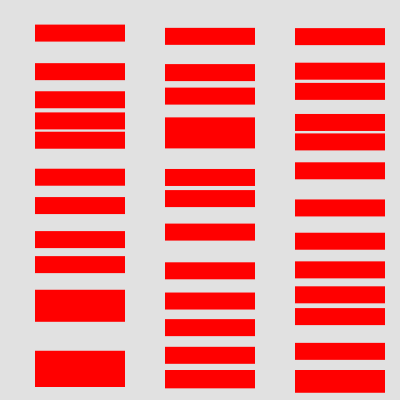

```js
function setup() {
  createCanvas(400, 400);
  background(225);
  let y = 17;
  let x = 35;

  for (i = 0; i < 3; i++) {
    noStroke();
    fill(255, 0, 0);
    rect(x, 370, 90, 17);
    let y = 17;
    for (j = 0; j < 13; j++) {
      let y = map(j, 0, 12, 17, 360);
      y = y + random(22);
      rect(x, y, 90, 17);
    }
    x = x + 130 
  }
}

```

Creating my own version of the work.  

I first created the ordered and 'perfect' version of the work without introducing deviations.   
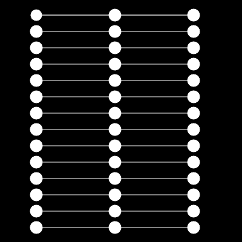
```js
function setup() {
  createCanvas(400, 400);
  background(0);
  for (i = 0; i < 14; i++) {
    for (j = 0; j < 3; j++) {
      circle(60 + 130 * j, 25 + 27 * i, 20);
      stroke(255);
      if (j < 2) {
        // i didnt want lines going out from the right column to right side
        line(60 + 130 * j, 25 + 27 * i, 60 + 130 * (j + 1), 25 + 27 * i);
      }
    }
  }
}
```
Molnar had slight variations in the angle of the rectangles as well as positions.  
In my work, I am going to maintain the positions of the circles, but change the angle of the lines (by randomising end point) and transparency of them. 
The way I use random() here is similar to the recreation of Molnar's work above. It cannot be anywhere on the canvas, and has limitations in terms of region.  
```js
function setup() {
  createCanvas(400, 400);
  background(0);
  var colour = [255, 40];
  for (i = 0; i < 14; i++) {
    for (j = 0; j < 3; j++) {
      //starting same colour
      stroke(255);
      fill(colour);
      circle(60 + 130 * j, 25 + 27 * i, 20);
      if (j < 2) {
        // i didnt want lines going out from the right column to right side
        line(
          60 + 130 * j,
          round(random(25 + 27 * i - 10, 25 + 27 * i + 10)), //radius + centre, min and max region
          60 + 130 * (j + 1),
          25 + 27 * i
        );
      }
    }
    colour = [255, 40 + i * random(20)];
  }
}
```
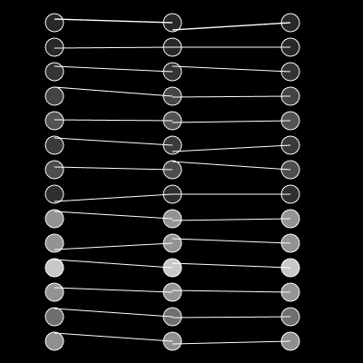

Code: https://editor.p5js.org/sizalyth/sketches/aKqMqp3Fa


